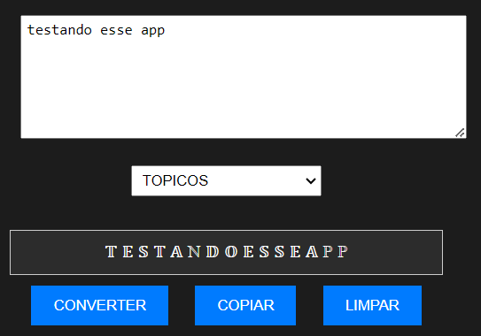

# FORMATADOR DE LETRAS
🔵FORMATE SEU TEXTO PARA DIVERSOS ESTILOS PERSONALIZADOS. 

  

## DESCRIÇÃO E COMO USAR:
Este aplicativo é um "Formatador de Letras" que permite converter texto inserido em diferentes estilos e formatos especiais. Aqui está uma descrição do que o aplicativo faz:

1. **Entrada de Texto**: Você pode digitar ou colar texto na caixa de texto fornecida.

2. **Seleção de Estilo de Conversão**: Utilizando uma lista suspensa, você pode selecionar o estilo de conversão desejado para o texto. As opções incluem:
   - **AZUL**: Converte o texto para um estilo azul com emojis representando cada caractere.
   - **TOPICOS**: Converte o texto para um estilo tipográfico com caracteres especiais.
   - **BARRATO**: Adiciona uma linha de corte sobre cada caractere no texto.
   - **SOTTOLINEATO**: Adiciona uma linha de sublinhado abaixo de cada caractere no texto.
   - **GRANDE**: Converte o texto para um estilo de letra grande.
   - **MAIUSCOLETTO**: Adiciona uma barra horizontal sobre cada caractere no texto.
   - **BOLHA PRETO/BOLHA BRANCO**: Substitui cada caractere por um caractere de bolha correspondente em preto ou branco.
   - **QUADRADO PRETO/QUADRADO BRANCO**: Substitui cada caractere por um caractere de quadrado correspondente em preto ou branco.
   - **INGLÊS ANTIGO**: Converte o texto para um estilo tipográfico antigo.
   - **CURSIVO PRETO/CURSIVO BRANCO**: Converte o texto para um estilo cursivo em preto ou branco.
   - **NEGRITO**: Converte o texto para um estilo negrito.
   - **HYPERLINKS**: Formata o texto como um hyperlink, exigindo que você insira um link.

3. **Botão "CONVERTER"**: Ao clicar neste botão, o texto inserido é convertido de acordo com o estilo selecionado.

4. **Botão "COPIAR"**: Este botão copia o texto convertido para a área de transferência do sistema.

5. **Botão "LIMPAR"**: Limpa tanto o campo de entrada quanto o campo de saída, permitindo que você comece novamente.

Este aplicativo fornece uma variedade de estilos de formatação de texto para atender às suas necessidades criativas ou funcionais.

## NÃO SABE?
- Entendemos que para manipular arquivos em `HTML`, `CSS` e outras linguagens relacionadas, é necessário possuir conhecimento nessas áreas. Para auxiliar nesse aprendizado, oferecemos cursos gratuitos disponíveis:
* [CURSO DE HTML E CSS](https://github.com/VILHALVA/CURSO-DE-HTML-E-CSS)
* [CURSO DE JAVASCRIPT](https://github.com/VILHALVA/CURSO-DE-JAVASCRIPT)
* [CONFIRA MAIS CURSOS](https://github.com/VILHALVA?tab=repositories&q=+topic:CURSO)

## CREDITOS:
- [PROJETO CRIADO PELO VILHALVA](https://github.com/VILHALVA)
- [ESTÁ DISPONIVEL NO SITE](https://vilhalva.github.io/STYLER/STYLER.html)

